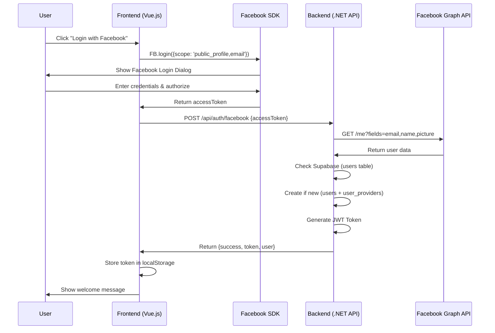
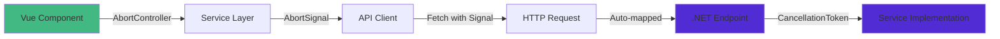

# IncomeApp

A modern full-stack personal expense management app built with Vue.js and .NET 10, using Vertical Slice Architecture and Facebook OAuth for authentication. Features an institutional-grade UI with a fixed sidebar, dark mode, and a fully responsive layout.

## 🛠️ Tech Stack

### Frontend
- Vue.js 3.x + TypeScript
- Vite 7.x
- Vue Router 4.x
- TanStack Query (Vue Query) for server state management
- CSS Custom Properties (no CSS framework — custom design system)
- Material Symbols Outlined (Google Fonts icons)

### Backend
- .NET 10 Web API (Minimal APIs)
- Supabase (PostgreSQL)
- Swagger / OpenAPI
- CORS Middleware
- Serilog (Structured Logging)

---

## 🏗️ Architecture

This project uses **Vertical Slice Architecture** — instead of grouping code by technical layer (Controllers / Services / Models), code is grouped by **feature**. Each feature is a self-contained vertical slice that owns its endpoint, models, and service logic.

```
backend/
└── Features/
    ├── Auth/                           # 🔐 Authentication slice
    │   ├── FacebookLoginEndpoint.cs    #   Endpoint
    │   ├── Models/                     #   Request & response models
    │   └── Services/                   #   Facebook login business logic
    │
    └── Financial/                      # 📊 Financial data slice
        ├── FinancialDataEndpoint.cs    #   Endpoint (CRUD for all financial data)
        ├── Models/                     #   Data models (Summary, Expense, Insurance, Debt)
        └── Services/                   #   Business logic & Supabase queries
```

**Benefits of Vertical Slice:**
- Each feature is independently modifiable without affecting others
- Easy to add new features — just create a new folder
- Related code lives together, no need to jump across layers

## 📁 Project Structure

```
IncomeApp/
├── frontend/                           # Vue.js + Vite Frontend
│   ├── src/
│   │   ├── components/                 # Reusable Vue components
│   │   │   ├── AppLayout/              # Shared layout: fixed sidebar + sticky top header (dark mode aware)
│   │   │   ├── AppExpenseSummary/      # Expense list+panel layout; category rows + detail panel
│   │   │   ├── CategoryBreakdown/      # Category display component
│   │   │   ├── DebtModal/              # Modal for debt CRUD (business style, dark mode)
│   │   │   ├── DebtTracker/            # "Recurring Payment" — installment progress bars
│   │   │   ├── ExpenseModal/           # Modal for expense CRUD (business style, dark mode)
│   │   │   ├── InsuranceModal/         # Modal for insurance CRUD (business style, dark mode)
│   │   │   ├── InsuranceTracker/       # "Incoming Payment" — timeline sorted by due date
│   │   │   ├── ProgressBar/            # Reusable progress bar with named actions slot
│   │   │   ├── SubscriptionTracker/    # Subscription tracking component
│   │   │   ├── SummaryCard/            # Summary card (primary/success/warning/info variants)
│   │   │   ├── SummaryEditModal/       # Modal for editing summary stats (business style, dark mode)
│   │   │   └── ThemeToggle/            # Dark/light theme toggle (Material Symbols icons)
│   │   ├── composables/
│   │   │   ├── useTheme.ts             # Theme management composable
│   │   │   └── useCrud.ts              # TanStack Query composables for CRUD
│   │   ├── router/
│   │   │   └── index.ts                # Vue Router configuration
│   │   ├── services/                   # API service layer
│   │   │   ├── apiClient.ts            # HTTP client with AbortSignal support
│   │   │   └── financialService.ts     # Financial API methods
│   │   ├── utils/
│   │   │   └── formatters.ts           # Number and date formatters
│   │   ├── views/
│   │   │   ├── Analytics/
│   │   │   │   ├── Analytics.vue       # Bento-grid analytics page (SVG donut, subscriptions table)
│   │   │   │   └── Analytics.css
│   │   │   ├── Dashboard/
│   │   │   │   ├── Dashboard.vue       # Hero summary card + expense category list+panel layout
│   │   │   │   └── Dashboard.css
│   │   │   ├── Trackers/
│   │   │   │   ├── Trackers.vue        # Insurance timeline + debt installment trackers
│   │   │   │   └── Trackers.css
│   │   │   └── Login/
│   │   │       ├── Login.vue
│   │   │       └── Login.css
│   │   ├── App.vue
│   │   ├── main.ts
│   │   ├── style.css                   # Global styles & design system (light + dark mode tokens)
│   │   └── vue-shim.d.ts
│   ├── .env                            # VITE_FACEBOOK_APP_ID
│   ├── .env.production
│   ├── index.html
│   ├── package.json
│   ├── tsconfig.json
│   ├── tsconfig.app.json
│   ├── tsconfig.node.json
│   └── vite.config.ts
│
└── backend/                            # .NET 10 Web API
    ├── Features/
    │   ├── Auth/
    │   │   ├── FacebookLoginEndpoint.cs
    │   │   ├── Models/
    │   │   │   ├── User.cs
    │   │   │   └── UserProvider.cs
    │   │   └── Services/
    │   │       ├── IFacebookLoginService.cs
    │   │       └── FacebookLoginService.cs
    │   └── Financial/
    │       ├── FinancialDataEndpoint.cs
    │       ├── Models/
    │       │   ├── FinancialData.cs
    │       │   ├── FinancialSummary.cs
    │       │   ├── ExpenseEntity.cs
    │       │   ├── InsuranceEntity.cs
    │       │   └── DebtEntity.cs
    │       └── Services/
    │           ├── IFinancialService.cs
    │           └── FinancialService.cs
    ├── Database/                       # SQL scripts & setup docs
    ├── Properties/
    ├── Program.cs                      # App startup & DI configuration
    ├── IncomeApp.csproj
    ├── appsettings.json
    ├── appsettings.Development.json
    └── appsettings.Production.json
```

---

## 🚀 Setup

### Prerequisites
- Node.js 22.4.1+
- .NET 10+ SDK

### 1. Facebook App Setup

To enable Facebook Login, you need a Facebook App ID:

1. Go to [developers.facebook.com](https://developers.facebook.com/) and log in.
2. Click **My Apps** → **Create App**.
3. Select **Use cases** → **Authenticate and request data from users with Facebook Login** → **Next**.
4. Select **No, I'm not building a game**.
5. Add an **App Name** (e.g., "IncomeApp") and click **Create app**.
6. On the Dashboard, find **App Settings** → **Basic** and copy the **App ID**.
7. Go to **Use Cases** → **Authentication and account creation/Login** → **Customize**.
8. Under **Permissions**, ensure **email** is added.
9. In `frontend`, create a `.env` file and add:
   ```env
   VITE_FACEBOOK_APP_ID=your_app_id_here
   ```

### 2. Supabase Setup

This project uses Supabase for storing user and financial data.

1. **Create a Supabase Project**: Go to [supabase.com](https://supabase.com/) and create a new project.
2. **Get Credentials**:
   - Go to **Project Settings** → **API**.
   - Copy the **Project URL** and **service_role key** (secret).
3. **Configure Backend**: In `backend`, create a `.env` file and add:
   ```env
   SUPABASE_URL=your_supabase_project_url
   SUPABASE_SERVICE_KEY=your_service_role_key
   ```
4. **Run Database Scripts**: See [`backend/Database/README.md`](backend/Database/README.md) for full SQL setup instructions.

   Tables required: `users`, `user_providers`, `financial_summaries`, `expenses`, `insurances`, `debts`

### 3. Run the Application

**Frontend:**
```bash
cd frontend
npm install
npm run dev -- --host
```
Available at **http://localhost:5173**

**Backend:**
```bash
cd backend
dotnet run
```
Available at **http://localhost:5098** — Swagger UI at **http://localhost:5098/swagger**

---

## 🔐 Authentication Flow

This app uses **Facebook OAuth** handled entirely on the backend for security.



### Step-by-Step Flow

**1. Initialize Facebook SDK** ([Login.vue](file:///Users/tuscaffy/Desktop/Antigravity%20Project/IncomeApp/frontend/src/views/Login.vue#L46-L73))
   - Load Facebook JavaScript SDK on component mount
   - Initialize with App ID from environment variables

**2. User Login** ([Login.vue](file:///Users/tuscaffy/Desktop/Antigravity%20Project/IncomeApp/frontend/src/views/Login.vue#L93-L139))
   - User clicks "Login with Facebook"
   - Frontend calls `FB.login()` with permissions `public_profile`, `email`
   - Facebook returns an `accessToken`

**3. Backend Verification** ([FacebookLoginEndpoint.cs](file:///Users/tuscaffy/Desktop/Antigravity%20Project/IncomeApp/backend/Features/Auth/FacebookLoginEndpoint.cs#L60-L75))
   - Backend calls Facebook Graph API to validate token and fetch user data
   - Checks `user_providers` table — creates new user record if first login
   - Generates a signed JWT valid for 7 days

**4. Session Storage** ([Login.vue](file:///Users/tuscaffy/Desktop/Antigravity%20Project/IncomeApp/frontend/src/views/Login.vue#L120-L125))
   - JWT token stored in `localStorage`
   - All subsequent API calls include `Authorization: Bearer {token}`

### Security Notes

- ✅ Token verification happens on the backend via Facebook Graph API
- ✅ Frontend never directly validates the token
- ✅ Backend generates its own JWT for session management
- 🔒 JWT tokens are signed by the backend, independent of Supabase Auth

---

## 🎨 Design System

All UI uses a unified **Financial Architect** design language:

- **Primary color**: Navy `#1A237E` (light) / Indigo `#818CF8` (dark) via `--color-primary`
- **Typography**: Inter font throughout — `font-weight: 800` for values, uppercase micro-labels (`0.6875rem`, `letter-spacing: 0.08em`) for section titles
- **Icons**: Material Symbols Outlined (same weight/size conventions as the sidebar nav icons)
- **Dark mode**: All colors use CSS custom properties; toggled via `[data-theme="dark"]` on `<html>`
- **Border radius**: Cards `16px`, modals `10px`, buttons/inputs `6px`

### CSS Variable Tokens

| Variable | Light | Dark |
|---|---|---|
| `--color-primary` | `#1A237E` | `#818CF8` |
| `--bg-card` | `#ffffff` | `#182035` |
| `--bg-sidebar` | `#ffffff` | `#141e2e` |
| `--bg-page` | `#F5F7F9` | `#0d1117` |
| `--border-color` | `#DEE3EB` | `#1e3050` |
| `--text-primary` | `#1A1C1E` | `#e2e8f0` |
| `--text-secondary` | `#43474E` | `#7a8fa6` |
| `--color-surface-variant` | `#F1F4F8` | `#1e3050` |

---

## 📊 Dashboard Features

The dashboard provides a comprehensive overview of the user's financial status.

### Section 1: Hero Summary Card
Full-width dark navy card showing the key portfolio metrics:

| Metric | Position |
|--------|----------|
| **Net Worth Growth** | Large hero value with +% badge |
| **Monthly Income** | Sub-metric (bottom row) |
| **Monthly Expenses** | Sub-metric (bottom row) |
| **Savings + Investment** | Sub-metric (bottom row) |
| **Savings Rate** | Sub-metric (bottom row) |

The edit button (top-right, white icon) opens a modal to update Income, Total Savings, Total Investment, and Net Worth Growth. Expenses are calculated automatically from recorded items.

### Section 2: Expense Categories — List + Detail Panel
Two-column layout (stacks on mobile):

- **Left panel**: Category rows showing bank/app badge, item count, amount, and percentage
- **Right panel**: Detail items for the selected category with highlight / edit / delete actions
- Clicking a row on mobile auto-scrolls to the detail panel below
- Empty state shows a Material Symbol icon with instruction text

### Section 3: Financial Trackers (Trackers page)
Moved to a dedicated `/trackers` route accessible from the sidebar.

- **Incoming Payment (Insurance Tracker)**: Timeline layout sorted by nearest due date. Dot status: red = overdue, navy = within 7 days, gray = future. Footer shows NEXT 30 DAYS total.
- **Recurring Payment (Debt Tracker)**: Progress bars per installment. Edit/delete appear on hover inside the white card, to the left of the `current/total` counter.

---

## 📈 Analytics Page

The Analytics page uses a **bento-grid layout** with data from the same `/api/financial/dashboard` endpoint (served from TanStack Query cache — no extra API call).

### Bento Top Row (3 cards)
| Card | Description |
|------|-------------|
| **Efficiency Score** | Savings rate as a 0–100 score with progress bar |
| **Monthly Savings** | Dime account savings amount and rate |
| **Subscription Alert** | Largest upcoming subscription cost |

### Bento Middle Row (2 cards)
- **Expense Breakdown**: SVG donut chart (no Chart.js) with legend showing distribution across banks/apps
- **Top Expenses**: Horizontal progress bars ranking the highest expense categories

### Activity Table
Full subscription list with columns: Name, Next Billing, Cycle, Amount, Bank. Subscriptions are hardcoded in `FinancialService.cs` and include services such as Netflix, YouTube Premium, Google Drive, Claude, and others.

---

## ⚡ Cancellation Token Support

All API requests support cancellation to prevent memory leaks and wasted resources.



**Frontend** — `AbortController` in Vue components, passed through service layer and `apiClient.ts` to `fetch()`.

**Backend** — ASP.NET Core automatically maps the cancelled HTTP request to a `CancellationToken`.

**Benefits:**
- ✅ Prevents memory leaks on component unmount
- ✅ Cancels redundant requests when new ones start
- ✅ Frees server CPU and network bandwidth immediately


---

## ⚡ TanStack Query (Vue Query)

All API calls use TanStack Query for efficient server state management.

### Composables

```typescript
// src/composables/useCrud.ts

// GET request with automatic caching
const { data, isLoading, error, refetch } = useApi<T>('/api/endpoint')

// POST/PUT/DELETE with automatic cache invalidation
const createMutation = useApiMutation<TData, TVariables>('post', '/api/endpoint')
createMutation.mutate({ ... })
```

### Features

| Feature | Description |
|---------|-------------|
| **Caching** | API responses are cached (default: 5 min staleTime) |
| **Auto Refetch** | Automatically refetches when returning to a page |
| **Deduplication** | Multiple components requesting same API = single request |
| **Optimistic Updates** | UI updates immediately, then syncs with server |
| **Loading/Error States** | Built-in states via `isLoading`, `isError`, `error` |

### Example: Dashboard & Analytics

Both pages use the same `/api/financial/dashboard` endpoint with the same cache key. When navigating between them:

1. First visit: API call → cache stored
2. Return visit: Instant data from cache (no API call)
3. Background refetch: Updates cache if data changed

This eliminates redundant API calls and provides a smoother user experience.


---

## 🪵 Structured Logging (Serilog)

The backend uses **Serilog** for structured JSON logging, designed for future observability and log-based analysis.

### Output Format

| Environment | Format | Sink |
|---|---|---|
| Development | Colored text (human-readable) | Console |
| Production | CLEF (Compact JSON per line) | stdout → Railway |

**Example — Production log line:**
```json
{"@t":"2026-03-14T10:22:01Z","@mt":"HTTP {RequestMethod} {RequestPath} responded {StatusCode} in {Elapsed:0.0000} ms","RequestMethod":"POST","RequestPath":"/api/auth/facebook","StatusCode":200,"Elapsed":312.4,"UserId":"550e8400-e29b-41d4-a716-446655440000","Application":"IncomeApp","EnvironmentName":"Production"}
```

### Enriched Fields (every log event)

| Field | Source |
|---|---|
| `Application` | Static: `"IncomeApp"` |
| `EnvironmentName` | `ASPNETCORE_ENVIRONMENT` |
| `MachineName` | Host machine name |
| `ThreadId` | Async thread context |
| `UserId` | JWT `sub` claim (when authenticated) |
| `RequestHost` / `RequestScheme` | HTTP request context |

### What Gets Logged

| Event | Level | Fields |
|---|---|---|
| HTTP request/response | `Information` | Method, Path, StatusCode, ElapsedMs, UserId |
| Facebook login success | `Information` | UserId, IsNewUser |
| New user registration | `Information` | UserId, ProviderName |
| Facebook token rejected | `Warning` | StatusCode |
| CRUD success (expense/insurance/debt) | `Information` | EntityId, UserId |
| Database errors | `Error` | Full exception, UserId |
| App startup / crash | `Information` / `Fatal` | — |

### Log Levels by Environment

- **Development**: `Information` for app code, `Warning` for Microsoft internals
- **Production**: `Warning` for all framework internals, `Information` for `IncomeApp.*` namespace only

### Future Observability

- **Seq** (local dashboard): Add `Serilog.Sinks.Seq` + `WriteTo.Seq("http://localhost:5341")` in `appsettings.Development.json`
- **OpenTelemetry**: Add `Serilog.Enrichers.Span` → `TraceId`/`SpanId` appear automatically in every log event
- **Grafana Loki / Datadog**: CLEF JSON is ingested directly with no format changes needed

---

## 📝 API Endpoints

All endpoints require `Authorization: Bearer {token}` except `/api/auth/facebook`.

> Swagger UI available at **http://localhost:5098/swagger** when running locally.

### Authentication

| Method | Endpoint | Description | Auth |
|--------|----------|-------------|------|
| POST | `/api/auth/facebook` | Facebook OAuth login, returns JWT | ❌ |

**Request:**
```json
{ "accessToken": "facebook_access_token" }
```
**Response:**
```json
{
  "success": true,
  "message": "Login successful",
  "token": "jwt_token",
  "user": { "id": "uuid", "email": "user@example.com", "name": "John Doe", "pictureUrl": "https://..." }
}
```

---

### Financial Dashboard

| Method | Endpoint | Description | Auth |
|--------|----------|-------------|------|
| GET | `/api/financial/dashboard` | Get full dashboard data | ✅ |
| POST | `/api/financial/summary` | Update income/savings/investment/net worth | ✅ |

**POST `/api/financial/summary` Request:**
```json
{
  "income": 50000,
  "totalSavings": 10000,
  "totalInvestment": 5000,
  "netWorthGrowth": 2000
}
```

---

### Expenses

| Method | Endpoint | Description | Auth |
|--------|----------|-------------|------|
| POST | `/api/financial/expenses` | Create new expense | ✅ |
| PUT | `/api/financial/expenses/{id}` | Update expense by ID | ✅ |
| DELETE | `/api/financial/expenses/{id}` | Delete expense by ID → `204` | ✅ |

**Request body (POST / PUT):**
```json
{
  "name": "Food",
  "amount": 8500,
  "type": "Variable",
  "color": "#FF6384",
  "bankApp": "Kbank",
  "isHighlighted": false
}
```
> `type`: `Fixed` | `Variable` | `Family` | `Health`  
> `bankApp`: `Dime` | `Make` | `KTB` | `Kbank` | `Office`

---

### Insurances

| Method | Endpoint | Description | Auth |
|--------|----------|-------------|------|
| POST | `/api/financial/insurances` | Create new insurance | ✅ |
| PUT | `/api/financial/insurances/{id}` | Update insurance by ID | ✅ |
| DELETE | `/api/financial/insurances/{id}` | Delete insurance by ID → `204` | ✅ |

**Request body (POST / PUT):**
```json
{
  "provider": "AIA",
  "policyName": "Life Plan",
  "premium": 3500,
  "dueDate": "2026-03-01T00:00:00",
  "status": "Upcoming"
}
```
> `status`: `Paid` | `Upcoming` | `Overdue`

---

### Debts

| Method | Endpoint | Description | Auth |
|--------|----------|-------------|------|
| POST | `/api/financial/debts` | Create new debt/installment | ✅ |
| PUT | `/api/financial/debts/{id}` | Update debt by ID | ✅ |
| DELETE | `/api/financial/debts/{id}` | Delete debt by ID → `204` | ✅ |

**Request body (POST / PUT):**
```json
{
  "name": "iPhone 15 Pro",
  "monthlyPayment": 1500,
  "currentInstallment": 1,
  "totalInstallments": 12,
  "remainingAmount": 18000,
  "totalAmount": 18000
}
```

---

### Response Status Codes

| Code | Description |
|------|-------------|
| 200 | OK |
| 201 | Created |
| 204 | No Content (deleted) |
| 401 | Unauthorized |
| 404 | Not Found |
| 500 | Internal Server Error |

---

## 🔄 UI Changelog

### Dark Mode System
- Added `--color-primary: #818CF8` override in `[data-theme="dark"]` so all navy accents become readable light indigo
- All hardcoded `#1A237E` text/icon color uses replaced with `var(--color-primary)` across every component CSS file
- Sidebar, top header, search input, and page background now use CSS variable tokens (`--bg-sidebar`, `--bg-header`, `--border-color`, `--color-surface-variant`, `--text-primary`)
- Hero card and active nav item backgrounds stay hardcoded navy — they render correctly on dark backgrounds

### Dashboard Redesign
- Removed 4-card summary grid; replaced with a single full-width dark navy hero card
- Hero card: NET WORTH GROWTH as main value, +% badge, 4 sub-metrics in a responsive grid row
- Edit button (white SVG icon, top-right of hero card) opens `SummaryEditModal`
- Section titles use uppercase navy micro-label style (`0.7rem`, `letter-spacing: 0.18em`)

### Expense Categories Redesign
- Replaced expandable card grid with a 2-column list + detail panel layout
- Left panel: category rows (badge, item count, amount, %)
- Right panel (desktop) / below (mobile): selected category items with highlight / edit / delete
- Mobile: auto-`scrollIntoView` on category selection
- Empty state: Material Symbol icon + "No Category Selected" instruction

### Trackers Page (new)
- Moved Insurance and Debt trackers off the Dashboard into a new `/trackers` route
- Sidebar link changed from disabled "Transactions" → active "Trackers" with `track_changes` icon
- Page header matches the Analytics page style (eyebrow + large title)

### InsuranceTracker — Timeline Layout
- Renamed to "Incoming Payment"
- Sorted by nearest due date using `getDaysUntil()`
- Timeline dots: red (overdue), navy (≤7 days), gray outline (future)
- Date format: `APR 23, 2026` with Buddhist Era year correction
- Footer: NEXT 30 DAYS total amount
- Edit/delete appear on row hover (always visible on mobile)

### DebtTracker — Progress Bar Actions
- Renamed to "Recurring Payment"
- `ProgressBar.vue` now accepts an `#actions` named slot rendered inside the white card header
- Edit/delete buttons passed via slot — appear to the left of `current/total`, revealed on hover

### Modal Redesign (all 4 modals)
- `border-radius: 10px` (squarer containers), `6px` for inputs and buttons
- Header separated by a bottom border divider; title `font-weight: 800`
- Form labels: uppercase micro-labels matching the app's section title style
- Inputs/selects: `var(--color-surface-variant)` background, `var(--border-color)` border, focus ring via `var(--color-primary)`
- Buttons: Cancel uses card-border style; Save uses `var(--color-primary)` with `var(--color-primary-dim)` on hover
- All Thai text translated to English throughout all modal templates

### Icon System
- Replaced emoji buttons (✏️, 🗑️, +) with Material Symbols Outlined icons (`edit`, `delete`, `add`)
- Consistent `mat-icon` CSS class across all tracker components

---

## 📄 License

This is a demonstration project.
