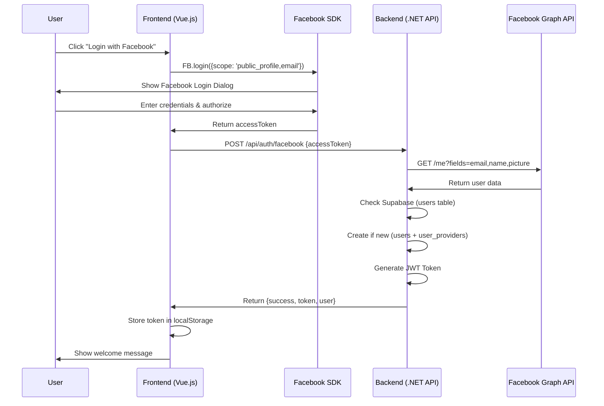
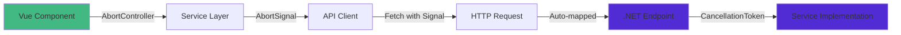

# IncomeApp

A modern full-stack personal finance tracker built with Vue.js and .NET 10, using Vertical Slice Architecture and Facebook OAuth for authentication.

## 🛠️ Tech Stack

### Frontend
- Vue.js 3.x + TypeScript
- Vite 7.x
- Vue Router 4.x
- Chart.js (via vue-chartjs)
- CSS Custom Properties

### Backend
- .NET 10 Web API (Minimal APIs)
- Supabase (PostgreSQL)
- Swagger / OpenAPI
- CORS Middleware

---

## 🏗️ Architecture

This project uses **Vertical Slice Architecture** — instead of grouping code by technical layer (Controllers / Services / Models), code is grouped by **feature**. Each feature is a self-contained vertical slice that owns its endpoint, models, and service logic.

```
backend/
└── Features/
    ├── Auth/                           # 🔐 Authentication slice
    │   ├── FacebookLoginEndpoint.cs    #   Endpoint
    │   ├── Models/                     #   Request & response models
    │   └── Services/                   #   Facebook login business logic
    │
    └── Financial/                      # 📊 Financial data slice
        ├── FinancialDataEndpoint.cs    #   Endpoint (CRUD for all financial data)
        ├── Models/                     #   Data models (Summary, Expense, Insurance, Debt)
        └── Services/                   #   Business logic & Supabase queries
```

**Benefits of Vertical Slice:**
- Each feature is independently modifiable without affecting others
- Easy to add new features — just create a new folder
- Related code lives together, no need to jump across layers

## 📁 Project Structure

```
IncomeApp/
├── frontend/                           # Vue.js + Vite Frontend
│   ├── src/
│   │   ├── components/                 # Reusable Vue components
│   │   │   ├── AppExpenseSummary/      # Expense summary with expandable cards
│   │   │   ├── CategoryBreakdown/      # Category display component
│   │   │   ├── DebtModal/              # Modal for debt CRUD
│   │   │   ├── DebtTracker/            # Debt tracking component
│   │   │   ├── ExpenseModal/           # Modal for expense CRUD
│   │   │   ├── InsuranceModal/         # Modal for insurance CRUD
│   │   │   ├── InsuranceTracker/       # Insurance tracking component
│   │   │   ├── ProgressBar/            # Progress bar component
│   │   │   ├── SubscriptionTracker/    # Subscription tracking component
│   │   │   ├── SummaryCard/            # Summary card for dashboard
│   │   │   ├── SummaryEditModal/       # Modal for editing summary stats
│   │   │   ├── ThemeToggle/            # Dark/light theme toggle
│   │   │   └── charts/                 # Chart components
│   │   │       ├── BarChart/
│   │   │       ├── DonutChart/
│   │   │       ├── GaugeChart/
│   │   │       └── PieChart/
│   │   ├── composables/
│   │   │   └── useTheme.ts             # Theme management composable
│   │   ├── router/
│   │   │   └── index.ts                # Vue Router configuration
│   │   ├── services/                   # API service layer
│   │   │   ├── apiClient.ts            # HTTP client with AbortSignal support
│   │   │   └── financialService.ts     # Financial API methods
│   │   ├── utils/
│   │   │   └── formatters.ts           # Number and date formatters
│   │   ├── views/
│   │   │   ├── Dashboard/
│   │   │   │   ├── Dashboard.vue
│   │   │   │   └── Dashboard.css
│   │   │   └── Login/
│   │   │       ├── Login.vue
│   │   │       └── Login.css
│   │   ├── App.vue
│   │   ├── main.ts
│   │   ├── style.css                   # Global styles & design system
│   │   └── vue-shim.d.ts
│   ├── .env                            # VITE_FACEBOOK_APP_ID
│   ├── .env.production
│   ├── index.html
│   ├── package.json
│   ├── tsconfig.json
│   ├── tsconfig.app.json
│   ├── tsconfig.node.json
│   └── vite.config.ts
│
└── backend/                            # .NET 10 Web API
    ├── Features/
    │   ├── Auth/
    │   │   ├── FacebookLoginEndpoint.cs
    │   │   ├── Models/
    │   │   │   ├── User.cs
    │   │   │   └── UserProvider.cs
    │   │   └── Services/
    │   │       ├── IFacebookLoginService.cs
    │   │       └── FacebookLoginService.cs
    │   └── Financial/
    │       ├── FinancialDataEndpoint.cs
    │       ├── Models/
    │       │   ├── FinancialData.cs
    │       │   ├── FinancialSummary.cs
    │       │   ├── ExpenseEntity.cs
    │       │   ├── InsuranceEntity.cs
    │       │   └── DebtEntity.cs
    │       └── Services/
    │           ├── IFinancialService.cs
    │           └── FinancialService.cs
    ├── Database/                       # SQL scripts & setup docs
    ├── Properties/
    ├── Program.cs                      # App startup & DI configuration
    ├── IncomeApp.csproj
    ├── appsettings.json
    ├── appsettings.Development.json
    └── appsettings.Production.json
```

---

## 🚀 Setup

### Prerequisites
- Node.js 22.4.1+
- .NET 10+ SDK

### 1. Facebook App Setup

To enable Facebook Login, you need a Facebook App ID:

1. Go to [developers.facebook.com](https://developers.facebook.com/) and log in.
2. Click **My Apps** → **Create App**.
3. Select **Use cases** → **Authenticate and request data from users with Facebook Login** → **Next**.
4. Select **No, I'm not building a game**.
5. Add an **App Name** (e.g., "IncomeApp") and click **Create app**.
6. On the Dashboard, find **App Settings** → **Basic** and copy the **App ID**.
7. Go to **Use Cases** → **Authentication and account creation/Login** → **Customize**.
8. Under **Permissions**, ensure **email** is added.
9. In `frontend`, create a `.env` file and add:
   ```env
   VITE_FACEBOOK_APP_ID=your_app_id_here
   ```

### 2. Supabase Setup

This project uses Supabase for storing user and financial data.

1. **Create a Supabase Project**: Go to [supabase.com](https://supabase.com/) and create a new project.
2. **Get Credentials**:
   - Go to **Project Settings** → **API**.
   - Copy the **Project URL** and **service_role key** (secret).
3. **Configure Backend**: In `backend`, create a `.env` file and add:
   ```env
   SUPABASE_URL=your_supabase_project_url
   SUPABASE_SERVICE_KEY=your_service_role_key
   ```
4. **Run Database Scripts**: See [`backend/Database/README.md`](backend/Database/README.md) for full SQL setup instructions.

   Tables required: `users`, `user_providers`, `financial_summaries`, `expenses`, `insurances`, `debts`

### 3. Run the Application

**Frontend:**
```bash
cd frontend
npm install
npm run dev -- --host
```
Available at **http://localhost:5173**

**Backend:**
```bash
cd backend
dotnet run
```
Available at **http://localhost:5098** — Swagger UI at **http://localhost:5098/swagger**

---

## 🔐 Authentication Flow

This app uses **Facebook OAuth** handled entirely on the backend for security.



### Step-by-Step Flow

**1. Initialize Facebook SDK** ([Login.vue](file:///Users/tuscaffy/Desktop/Antigravity%20Project/IncomeApp/frontend/src/views/Login.vue#L46-L73))
   - Load Facebook JavaScript SDK on component mount
   - Initialize with App ID from environment variables

**2. User Login** ([Login.vue](file:///Users/tuscaffy/Desktop/Antigravity%20Project/IncomeApp/frontend/src/views/Login.vue#L93-L139))
   - User clicks "Login with Facebook"
   - Frontend calls `FB.login()` with permissions `public_profile`, `email`
   - Facebook returns an `accessToken`

**3. Backend Verification** ([FacebookLoginEndpoint.cs](file:///Users/tuscaffy/Desktop/Antigravity%20Project/IncomeApp/backend/Features/Auth/FacebookLoginEndpoint.cs#L60-L75))
   - Backend calls Facebook Graph API to validate token and fetch user data
   - Checks `user_providers` table — creates new user record if first login
   - Generates a signed JWT valid for 7 days

**4. Session Storage** ([Login.vue](file:///Users/tuscaffy/Desktop/Antigravity%20Project/IncomeApp/frontend/src/views/Login.vue#L120-L125))
   - JWT token stored in `localStorage`
   - All subsequent API calls include `Authorization: Bearer {token}`

### Security Notes

- ✅ Token verification happens on the backend via Facebook Graph API
- ✅ Frontend never directly validates the token
- ✅ Backend generates its own JWT for session management
- 🔒 JWT tokens are signed by the backend, independent of Supabase Auth

---

## 📊 Dashboard Features

The dashboard provides a comprehensive overview of the user's financial status.

### Section 1: Summary Cards
Four key financial metrics:

| Card | Description |
|------|-------------|
| **Income** 💰 | Total income (blue accent) |
| **Expenses** 💸 | Total expenses as % of income (yellow accent) |
| **Savings + Investment** 🎯 | Combined amount as % of income (green accent) |
| **Net Worth Growth** 📈 | Net worth increase vs. previous month (purple accent) |

### Section 2: Financial Charts
- **Expense Summary by App**: Pie chart showing expense distribution across apps/banks
- **Top 5 Expenses**: Bar chart of the highest expense categories

### Section 3: Expense Categories
- Expandable cards grouping expenses by app/bank
- Subscription tracking for recurring payments
- Itemized breakdown per category

### Section 4: Financial Trackers
- **Insurance Tracker**: Monitor policies and upcoming premium payments
- **Debt Tracker**: Track installment progress and remaining balances

---

## ⚡ Cancellation Token Support

All API requests support cancellation to prevent memory leaks and wasted resources.



**Frontend** — `AbortController` in Vue components, passed through service layer and `apiClient.ts` to `fetch()`.

**Backend** — ASP.NET Core automatically maps the cancelled HTTP request to a `CancellationToken`.

**Benefits:**
- ✅ Prevents memory leaks on component unmount
- ✅ Cancels redundant requests when new ones start
- ✅ Frees server CPU and network bandwidth immediately


---

## 📝 API Endpoints

All endpoints require `Authorization: Bearer {token}` except `/api/auth/facebook`.

> Swagger UI available at **http://localhost:5098/swagger** when running locally.

### Authentication

| Method | Endpoint | Description | Auth |
|--------|----------|-------------|------|
| POST | `/api/auth/facebook` | Facebook OAuth login, returns JWT | ❌ |

**Request:**
```json
{ "accessToken": "facebook_access_token" }
```
**Response:**
```json
{
  "success": true,
  "message": "Login successful",
  "token": "jwt_token",
  "user": { "id": "uuid", "email": "user@example.com", "name": "John Doe", "pictureUrl": "https://..." }
}
```

---

### Financial Dashboard

| Method | Endpoint | Description | Auth |
|--------|----------|-------------|------|
| GET | `/api/financial/dashboard` | Get full dashboard data | ✅ |
| POST | `/api/financial/summary` | Update income/savings/investment/net worth | ✅ |

**POST `/api/financial/summary` Request:**
```json
{
  "income": 50000,
  "totalSavings": 10000,
  "totalInvestment": 5000,
  "netWorthGrowth": 2000
}
```

---

### Expenses

| Method | Endpoint | Description | Auth |
|--------|----------|-------------|------|
| POST | `/api/financial/expenses` | Create new expense | ✅ |
| PUT | `/api/financial/expenses/{id}` | Update expense by ID | ✅ |
| DELETE | `/api/financial/expenses/{id}` | Delete expense by ID → `204` | ✅ |

**Request body (POST / PUT):**
```json
{
  "name": "Food",
  "amount": 8500,
  "type": "Variable",
  "color": "#FF6384",
  "bankApp": "Kbank"
}
```
> `type`: `Fixed` | `Variable` | `Family` | `Health`  
> `bankApp`: `Dime` | `Make` | `KTB` | `Kbank` | `Office`

---

### Insurances

| Method | Endpoint | Description | Auth |
|--------|----------|-------------|------|
| POST | `/api/financial/insurances` | Create new insurance | ✅ |
| PUT | `/api/financial/insurances/{id}` | Update insurance by ID | ✅ |
| DELETE | `/api/financial/insurances/{id}` | Delete insurance by ID → `204` | ✅ |

**Request body (POST / PUT):**
```json
{
  "provider": "AIA",
  "policyName": "Life Plan",
  "premium": 3500,
  "dueDate": "2026-03-01T00:00:00",
  "status": "Upcoming"
}
```
> `status`: `Paid` | `Upcoming` | `Overdue`

---

### Debts

| Method | Endpoint | Description | Auth |
|--------|----------|-------------|------|
| POST | `/api/financial/debts` | Create new debt/installment | ✅ |
| PUT | `/api/financial/debts/{id}` | Update debt by ID | ✅ |
| DELETE | `/api/financial/debts/{id}` | Delete debt by ID → `204` | ✅ |

**Request body (POST / PUT):**
```json
{
  "name": "iPhone 15 Pro",
  "monthlyPayment": 1500,
  "currentInstallment": 1,
  "totalInstallments": 12,
  "remainingAmount": 18000,
  "totalAmount": 18000
}
```

---

### Response Status Codes

| Code | Description |
|------|-------------|
| 200 | OK |
| 201 | Created |
| 204 | No Content (deleted) |
| 401 | Unauthorized |
| 404 | Not Found |
| 500 | Internal Server Error |

---

## 📄 License

This is a demonstration project.
