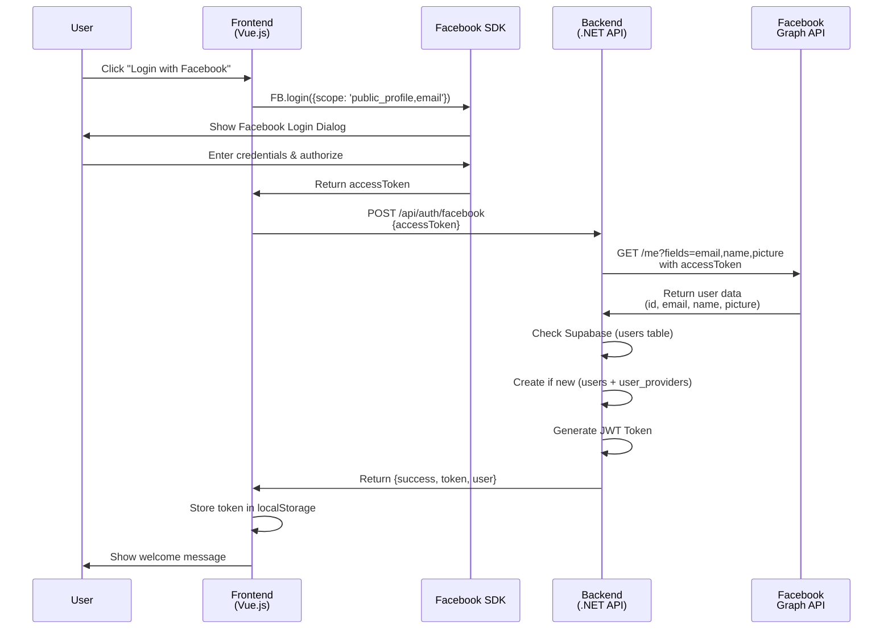
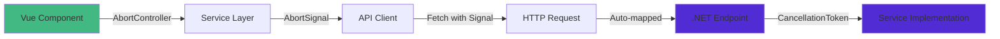

# IncomeApp

A modern full-stack application demonstrating vertical slice architecture with a minimalist login page.

## 🚀 Quick Start

### Prerequisites
- Node.js 22.4.1+
- .NET 10+ SDK

### 📘 Facebook Setup

To enable Facebook Login, you need a Facebook App ID:

1. Go to [developers.facebook.com](https://developers.facebook.com/) and log in.
2. Click **My Apps** -> **Create App**.
3. Select **Use cases** -> **Authenticate and request data from users with Facebook Login** -> **Next**.
4. Select **No, I'm not building a game**.
5. Add an **App Name** (e.g., "IncomeApp") and click **Create app**.
6. On the Dashboard, find **App Settings** -> **Basic**.
7. Copy the **App ID**.
8. Go to **Use Cases** -> **Authentication and account creation/Login** -> **Customize**.
9. Under **Permissions**, ensure **email** is added. If not, click **Add** next to `email`.
10. In `frontend`, create a `.env` file and add: `VITE_FACEBOOK_APP_ID=your_app_id_here`.

### ⚡ Supabase Setup

This project uses Supabase for storing user data. You need to set up a Supabase project and database tables.

1.  **Create a Supabase Project**: Go to [supabase.com](https://supabase.com/) and create a new project.
2.  **Get Credentials**:
    -   Go to **Project Settings** -> **API**.
    -   Copy the **Project URL** and **service_role key** (secret).
3.  **Backend Configuration**:
    -   In `backend`, create a `.env` file.
    -   Add the following variables:
        ```env
        SUPABASE_URL=your_supabase_project_url
        SUPABASE_SERVICE_KEY=your_service_role_key
        ```

#### Database Schema

Run the following SQL in your Supabase SQL Editor to create the necessary tables:

```sql
-- Create users table
create table public.users (
  id uuid not null default gen_random_uuid (),
  email text not null,
  name text null,
  picture_url text null,
  created_at timestamp without time zone not null default now(),
  updated_at timestamp without time zone not null default now(),
  constraint users_pkey primary key (id)
);

-- Create user_providers table
create table public.user_providers (
  id uuid not null default gen_random_uuid (),
  user_id uuid not null,
  provider_name text not null,
  provider_user_id text not null,
  provider_email text null,
  provider_data jsonb null,
  created_at timestamp without time zone not null default now(),
  updated_at timestamp without time zone not null default now(),
  constraint user_providers_pkey primary key (id),
  constraint user_providers_user_id_fkey foreign key (user_id) references users (id) on delete cascade
);
```

#### Financial Tables

For complete database setup including the `financial_summaries` table and other financial tables (`expenses`, `insurances`, `debts`), see the comprehensive documentation at [`backend/Database/README.md`](file:///Users/tuscaffy/Desktop/Antigravity%20Project/IncomeApp/backend/Database/README.md).

**Quick Summary:**
- **financial_summaries**: Stores income, savings, investments, and net worth growth
- **expenses**: Tracks expense categories and breakdown by app/bank
- **insurances**: Monitors insurance policies and premiums
- **debts**: Tracks outstanding debts and payment schedules

All SQL scripts are located in [`backend/Database/`](file:///Users/tuscaffy/Desktop/Antigravity%20Project/IncomeApp/backend/Database/).

### 🔄 Facebook Login Flow

This section explains the complete authentication flow from frontend to backend:



#### Step-by-Step Flow

**1. Frontend: Initialize Facebook SDK** ([Login.vue](file:///Users/tuscaffy/Desktop/Antigravity%20Project/IncomeApp/frontend/src/views/Login.vue#L46-L73))
   - Load Facebook JavaScript SDK on component mount
   - Initialize with App ID from environment variables
   - Configure SDK with version `v18.0`

**2. User Interaction** ([Login.vue](file:///Users/tuscaffy/Desktop/Antigravity%20Project/IncomeApp/frontend/src/views/Login.vue#L93-L139))
   - User clicks "Login with Facebook" button
   - Frontend calls `FB.login()` with requested permissions (`public_profile`, `email`)
   - Facebook shows OAuth login dialog

**3. Facebook Authentication**
   - User enters credentials in Facebook's popup
   - User authorizes the application
   - Facebook returns an `accessToken` to the frontend

**4. Frontend to Backend** ([Login.vue](file:///Users/tuscaffy/Desktop/Antigravity%20Project/IncomeApp/frontend/src/views/Login.vue#L110-L116))
   - Frontend sends POST request to `http://localhost:5098/api/auth/facebook`
   - Request body: `{ "accessToken": "..." }`
   - Headers: `Content-Type: application/json`

**5. Backend: Verify Token** ([FacebookLoginEndpoint.cs](file:///Users/tuscaffy/Desktop/Antigravity%20Project/IncomeApp/backend/Features/Auth/FacebookLoginEndpoint.cs#L60-L75))
   - Backend receives the access token
   - Makes request to Facebook Graph API: `https://graph.facebook.com/me?fields=email,name,picture&access_token={token}`
   - Validates the response from Facebook
   - Extracts user data (id, email, name, picture URL)

**6. Backend: User Management** ([FacebookLoginEndpoint.cs](file:///Users/tuscaffy/Desktop/Antigravity%20Project/IncomeApp/backend/Features/Auth/FacebookLoginEndpoint.cs#L81-L113))
   - Backend queries `user_providers` table in Supabase for matching Facebook ID
   - **If User Exists**: Retrieves the linked user record from `users` table
   - **If New User**:
     - Creates new record in `users` table
     - Creates linking record in `user_providers` table
   - Uses `ISupabaseService` to handle database interactions

**7. Backend: Generate JWT** ([FacebookLoginEndpoint.cs](file:///Users/tuscaffy/Desktop/Antigravity%20Project/IncomeApp/backend/Features/Auth/FacebookLoginEndpoint.cs#L86-L109))
   - Create JWT claims (user ID, email, name, Facebook ID)
   - Sign token with secret key from configuration
   - Set expiration to 7 days
   - Return token string

**8. Backend Response** ([FacebookLoginEndpoint.cs](file:///Users/tuscaffy/Desktop/Antigravity%20Project/IncomeApp/backend/Features/Auth/FacebookLoginEndpoint.cs#L111-L116))
   ```json
   {
     "success": true,
     "message": "Login successful",
     "token": "eyJhbGciOiJIUzI1NiIsInR5cCI6IkpXVCJ9...",
     "user": {
       "id": "...",
       "email": "user@example.com",
       "name": "John Doe",
       "pictureUrl": "https://..."
     }
   }
   ```

**9. Frontend: Store Session** ([Login.vue](file:///Users/tuscaffy/Desktop/Antigravity%20Project/IncomeApp/frontend/src/views/Login.vue#L120-L125))
   - Receive response from backend
   - Store JWT token in `localStorage`
   - Display welcome message to user
   - User is now authenticated

#### Security Notes

- ✅ Token verification happens on the backend by calling Facebook Graph API
- ✅ Frontend never directly validates the token
- ✅ Backend generates its own JWT for session management
- ✅ JWT includes user claims for authorization
- ⚠️ Implementation uses `ISupabaseService` to persist users
- 🔒 Supabase handles secure data storage
- 🔒 JWT tokens are signed by the backend, independent of Supabase Auth

### Frontend Setup

```bash
cd frontend
npm install --cache=/tmp/npm-cache
npm run dev -- --host
```

The frontend will be available at **http://localhost:5173**

### Backend Setup

```bash
cd backend
dotnet run
```

The backend API will be available at **http://localhost:5098**

## 🏗️ Architecture

This project uses **Vertical Slice Architecture** where features are organized as self-contained slices:

```
backend/
└── Features/
    └── Auth/
        └── FacebookLoginEndpoint.cs    # Facebook OAuth feature slice
```

Each feature contains:
- Request/Response models
- Endpoint configuration
- Business logic

## ✨ Features

### 🎨 Design System
- Minimalist aesthetic
- Clean white background
- Typography-focused design
- Subtle interactions
- Responsive design

### 🔐 Login Page
- Facebook Authentication only
- Clean, distraction-free interface
- Error handling with styled notifications
- Streamlined user experience

### 📊 Dashboard
The dashboard provides a comprehensive overview of your financial status with multiple sections displaying different aspects of your finances:

#### Section 1: Money Flow Summary Cards
Four key financial metrics displayed as summary cards:

1. **รายได้ (Income)** 💰
   - Shows total income
   - Info variant card with blue accent

2. **ค่าใช้จ่าย (Expenses)** 💸
   - Displays total expenses
   - Shows percentage of income spent
   - Warning variant card with yellow accent

3. **เงินออม + ลงทุน (Savings + Investment)** 🎯
   - Combined savings and investment amount
   - Shows percentage of income saved/invested
   - Success variant card with green accent

4. **Net Worth Growth** 📈
   - Displays net worth increase
   - Shows percentage growth from previous month
   - Primary variant card with purple accent

#### Section 2: Financial Overview Charts
Visual representation of financial data:

- **สรุปค่าใช้จ่ายตาม App (Expense Summary by App)**: Pie chart showing expense distribution across different apps
- **ค่าใช้จ่ายสูงสุด 5 อันดับ (Top 5 Expenses)**: Bar chart displaying the highest expense categories

#### Section 3: Expense Categories
Detailed breakdown of expenses:

- **หมวดหมู่ค่าใช้จ่าย (Expense Categories)**: Expandable cards showing expenses grouped by apps and categories
- Includes subscription tracking for recurring payments
- Each category card displays total amount and itemized breakdown

#### Section 4: Financial Trackers
Two tracking components for long-term financial items:

- **Insurance Tracker**: Monitors insurance policies and premiums
- **Debt Tracker**: Tracks outstanding debts and payment schedules

### 🔧 Backend API
- .NET Web API with minimal APIs
- CORS configured for frontend
- Swagger/OpenAPI documentation at `/swagger`
- Vertical slice architecture

### ⚡ Cancellation Token Support

The application implements comprehensive request cancellation support from frontend to backend, preventing memory leaks and unnecessary processing.

#### Architecture



#### Frontend Implementation

**AbortController Pattern** in Vue components ([Dashboard.vue](file:///Users/tuscaffy/Desktop/Antigravity%20Project/IncomeApp/frontend/src/views/Dashboard/Dashboard.vue)):

```typescript
import { ref, onBeforeUnmount } from 'vue';

const abortController = ref<AbortController | null>(null);

const loadData = async () => {
  // Cancel previous request if still pending
  if (abortController.value) {
    abortController.value.abort();
  }

  abortController.value = new AbortController();
  
  try {
    const data = await financialService.getDashboard(abortController.value.signal);
    // Process data
  } catch (error) {
    if (error.name === 'AbortError') {
      console.log('Request cancelled');
      return;
    }
    // Handle other errors
  }
};

// Cancel on component unmount
onBeforeUnmount(() => {
  abortController.value?.abort();
});
```

**Service Layer** ([financialService.ts](file:///Users/tuscaffy/Desktop/Antigravity%20Project/IncomeApp/frontend/src/services/financialService.ts)) - all methods accept optional `AbortSignal`:

```typescript
async getDashboard(signal?: AbortSignal): Promise<DashboardSummary> {
  return apiClient.get<DashboardSummary>('/api/financial/dashboard', signal);
}
```

**API Client** ([apiClient.ts](file:///Users/tuscaffy/Desktop/Antigravity%20Project/IncomeApp/frontend/src/services/apiClient.ts)) - passes signal to fetch:

```typescript
async get<T>(endpoint: string, signal?: AbortSignal): Promise<T> {
  const response = await fetch(url, {
    method: 'GET',
    headers: { /* ... */ },
    signal  // Native fetch API support
  });
  return response.json();
}
```

#### Backend Implementation

**Endpoints** ([FinancialDataEndpoint.cs](file:///Users/tuscaffy/Desktop/Antigravity%20Project/IncomeApp/backend/Features/Financial/FinancialDataEndpoint.cs)) - ASP.NET Core auto-provides CancellationToken:

```csharp
[HttpGet("dashboard")]
public async Task<ActionResult<DashboardSummary>> GetDashboard(CancellationToken cancellationToken)
{
    var userId = GetUserId();
    var dashboard = await _financialService.GetDashboardSummaryAsync(userId, cancellationToken);
    return Ok(dashboard);
}
```

**Service Interface** ([IFinancialService.cs](file:///Users/tuscaffy/Desktop/Antigravity%20Project/IncomeApp/backend/Features/Financial/Services/IFinancialService.cs)):

```csharp
Task<DashboardSummary> GetDashboardSummaryAsync(string userId, CancellationToken cancellationToken = default);
```

**Service Implementation** ([FinancialService.cs](file:///Users/tuscaffy/Desktop/Antigravity%20Project/IncomeApp/backend/Features/Financial/Services/FinancialService.cs)):

```csharp
public Task<DashboardSummary> GetDashboardSummaryAsync(string userId, CancellationToken cancellationToken = default)
{
    cancellationToken.ThrowIfCancellationRequested();
    // Process data
    return Task.FromResult(summary);
}
```

#### Benefits

✅ **Prevents Memory Leaks**: Cancelled requests don't execute callbacks on unmounted components
✅ **Saves Resources**: Network bandwidth and server CPU are freed immediately
✅ **Better UX**: No console errors from stale responses
✅ **Standards Compliant**: Uses web standards (AbortController) and .NET best practices (CancellationToken)

#### Request Cancellation Scenarios

1. **Component Unmount**: User navigates away → `onBeforeUnmount()` cancels pending requests
2. **Rapid Requests**: New request starts → previous request is automatically cancelled
3. **User Action**: Can be extended for explicit cancellation (e.g., cancel buttons)

## 📁 Project Structure

```
IncomeApp/
├── frontend/                           # Vue.js + Vite Frontend
│   ├── src/
│   │   ├── components/                 # Reusable Vue components
│   │   │   ├── AppExpenseSummary/      # Expense summary with expandable cards
│   │   │   ├── CategoryBreakdown/      # Category display component
│   │   │   ├── DebtModal/              # Modal for debt CRUD
│   │   │   ├── DebtTracker/            # Debt tracking component
│   │   │   ├── ExpenseModal/           # Modal for expense CRUD
│   │   │   ├── InsuranceModal/         # Modal for insurance CRUD
│   │   │   ├── InsuranceTracker/       # Insurance tracking component
│   │   │   ├── ProgressBar/            # Progress bar component
│   │   │   ├── SubscriptionTracker/    # Subscription tracking component
│   │   │   ├── SummaryCard/            # Summary card for dashboard
│   │   │   ├── SummaryEditModal/       # Modal for editing summary stats
│   │   │   ├── ThemeToggle/            # Dark/light theme toggle
│   │   │   └── charts/                 # Chart components
│   │   │       ├── BarChart/           # Bar chart visualization
│   │   │       ├── DonutChart/         # Donut chart visualization
│   │   │       ├── GaugeChart/         # Gauge chart visualization
│   │   │       └── PieChart/           # Pie chart visualization
│   │   ├── composables/
│   │   │   └── useTheme.ts             # Theme management composable
│   │   ├── router/
│   │   │   └── index.ts                # Vue Router configuration
│   │   ├── services/                   # API service layer
│   │   │   ├── apiClient.ts            # HTTP client with AbortSignal support
│   │   │   └── financialService.ts     # Financial API methods
│   │   ├── utils/
│   │   │   └── formatters.ts           # Number and date formatters
│   │   ├── views/                      # Page components
│   │   │   ├── Dashboard/              # Main dashboard page
│   │   │   │   ├── Dashboard.vue
│   │   │   │   └── Dashboard.css
│   │   │   └── Login/                  # Login page
│   │   │       ├── Login.vue
│   │   │       └── Login.css
│   │   ├── App.vue                     # Root component
│   │   ├── main.ts                     # Application entry point
│   │   └── style.css                   # Global styles & design system
│   ├── .env                            # Environment variables (VITE_FACEBOOK_APP_ID)
│   ├── package.json
│   ├── tsconfig.json
│   └── vite.config.ts
│
└── backend/                            # .NET 10 Web API
    ├── Features/                       # Vertical slice architecture
    │   ├── Auth/                       # Authentication feature
    │   │   ├── FacebookLoginEndpoint.cs    # Facebook OAuth endpoint
    │   │   ├── FacebookLoginRequest.cs     # Request model
    │   │   ├── FacebookLoginResponse.cs    # Response model
    │   │   └── Services/
    │   │       ├── ISupabaseService.cs     # Supabase service interface
    │   │       └── SupabaseService.cs      # Supabase implementation
    │   └── Financial/                  # Financial data feature
    │       ├── FinancialDataEndpoint.cs    # Financial API endpoints (with CancellationToken)
    │       ├── Models/
    │       │   └── FinancialData.cs        # Data models
    │       └── Services/
    │           ├── IFinancialService.cs    # Service interface (with CancellationToken)
    │           └── FinancialService.cs     # Service implementation (with CancellationToken)
    ├── .env                            # Environment variables (SUPABASE_URL, SUPABASE_SERVICE_KEY)
    ├── Program.cs                      # Application startup & configuration
    ├── IncomeApp.csproj                # Project file
    └── appsettings.json                # App configuration
```

### Architecture Highlights

- **Frontend**: Component-based architecture with clear separation of concerns
  - Components are organized by feature in individual folders
  - Services layer handles all API communication with cancellation support
  - Composables for shared reactive logic (theme management)
  
- **Backend**: Vertical slice architecture
  - Each feature is self-contained (Auth, Financial)
  - Services implement dependency injection
  - All async operations support CancellationToken
  
- **Cancellation Support**: End-to-end request cancellation from Vue components to .NET services

## 🧪 Testing the Login

1. Navigate to http://localhost:5173
2. Click the "Login with Facebook" button
3. Observe the console log "Login with Facebook clicked" (Placeholder for OAuth flow)

## 🎯 Next Steps

- [ ] Add database integration (Entity Framework Core)
- [ ] Implement actual Facebook OAuth integration
- [ ] Create additional feature slices (Dashboard, Profile, etc.)
- [ ] Add state management (Pinia)

## 🛠️ Technologies

### Frontend
- Vue.js 3.x
- Vite 7.x
- Vue Router 4.x
- TypeScript
- CSS Custom Properties

### Backend
- .NET 10+ Web API
- Supabase (PostgreSQL)
- Minimal APIs
- Swagger/OpenAPI
- CORS Middleware

## 📝 API Endpoints

### Base URLs

- **Frontend**: `http://localhost:5173`
- **Backend API**: `http://localhost:5098`
- **Swagger Documentation**: `http://localhost:5098/swagger`

### Available Endpoints

All endpoints require JWT authentication via `Authorization: Bearer {token}` header (except `/api/auth/facebook`).

#### Authentication

| Method | Endpoint | Description | Auth Required |
|--------|----------|-------------|---------------|
| POST | `/api/auth/facebook` | Facebook OAuth login | ❌ No |

**Request Body:**
```json
{
  "accessToken": "facebook_access_token"
}
```

**Response:**
```json
{
  "success": true,
  "message": "Login successful",
  "token": "jwt_token",
  "user": {
    "id": "user_id",
    "email": "user@example.com",
    "name": "User Name",
    "pictureUrl": "https://..."
  }
}
```

---

#### Financial Dashboard

| Method | Endpoint | Description | Auth Required |
|--------|----------|-------------|---------------|
| GET | `/api/financial/dashboard` | Get complete dashboard data | ✅ Yes |
| POST | `/api/financial/summary` | Update summary statistics | ✅ Yes |

---

#### Expenses Management

| Method | Endpoint | Description | Auth Required |
|--------|----------|-------------|---------------|
| POST | `/api/financial/expenses` | Create new expense | ✅ Yes |
| PUT | `/api/financial/expenses/{id}` | Update expense by ID | ✅ Yes |
| DELETE | `/api/financial/expenses/{id}` | Delete expense by ID | ✅ Yes |

**Example Request (Create Expense):**
```json
{
  "name": "กิน",
  "amount": 8500,
  "type": "Variable",
  "bankApp": "Kbank"
}
```

---

#### Insurance Management

| Method | Endpoint | Description | Auth Required |
|--------|----------|-------------|---------------|
| POST | `/api/financial/insurances` | Create new insurance | ✅ Yes |
| PUT | `/api/financial/insurances/{id}` | Update insurance by ID | ✅ Yes |
| DELETE | `/api/financial/insurances/{id}` | Delete insurance by ID | ✅ Yes |

**Example Request (Create Insurance):**
```json
{
  "provider": "AIA",
  "policyName": "แผนชีวิต",
  "premium": 3500,
  "dueDate": "2026-03-01T00:00:00",
  "status": "Upcoming"
}
```

---

#### Debt/Installment Management

| Method | Endpoint | Description | Auth Required |
|--------|----------|-------------|---------------|
| POST | `/api/financial/debts` | Create new debt/installment | ✅ Yes |
| PUT | `/api/financial/debts/{id}` | Update debt by ID | ✅ Yes |
| DELETE | `/api/financial/debts/{id}` | Delete debt by ID | ✅ Yes |

**Example Request (Create Debt):**
```json
{
  "name": "iPhone 15 Pro",
  "monthlyPayment": 1500,
  "currentInstallment": 1,
  "totalInstallments": 12,
  "remainingAmount": 18000,
  "totalAmount": 18000
}
```

---

### Response Status Codes

| Code | Description |
|------|-------------|
| 200 | OK - Request successful |
| 201 | Created - Resource created successfully |
| 204 | No Content - Resource deleted successfully |
| 401 | Unauthorized - Invalid or missing JWT token |
| 404 | Not Found - Resource not found |
| 500 | Internal Server Error - Server error occurred |

---

When the backend is running, visit **http://localhost:5098/swagger** for interactive API documentation.

## 🎨 Design Highlights

- **Style**: Minimalist, Clean, Modern
- **Background**: Pure white
- **Focus**: Content and Action
- **Responsiveness**: Mobile-first approach

## 📄 License

This is a demonstration project.
